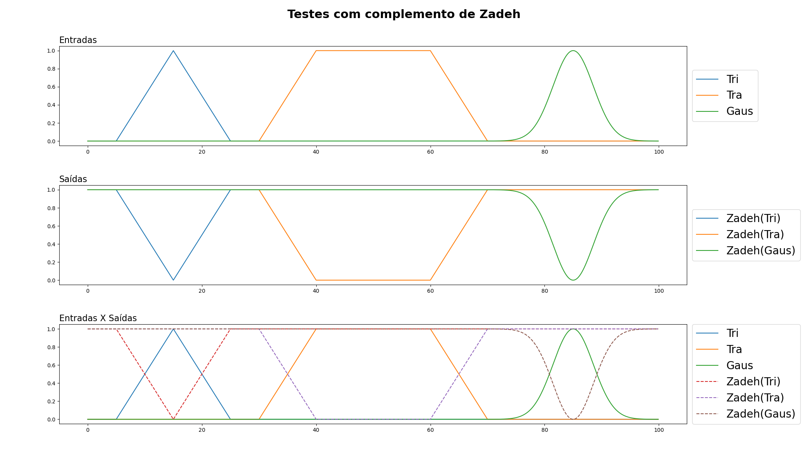
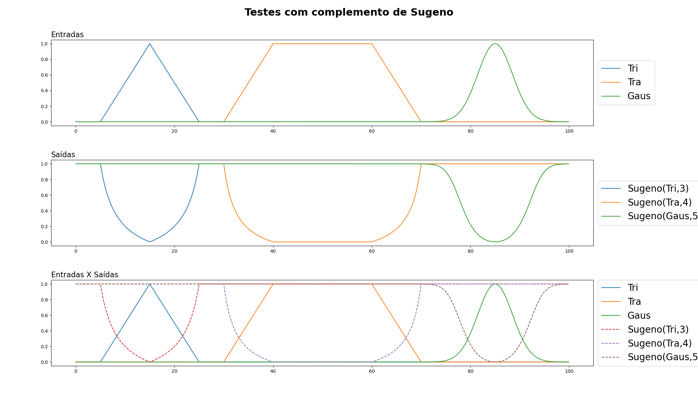

# Sistemas Fuzzy

Para realização desse trabalho fio utilizado as seguintes ferrramentas:
* **Python**: como linguagem de programação.
* **Numpy**: (Numerical Python) Biblioteca de Python que suporta o processamento de grandes e multi-dimensionais arranjos arrays, juntamente com uma coleção de funções matemáticas de alto nível para operar sobre estas matrizes. 
* **Matplotlib**: Biblioteca de software para criação de gráficos e visualizações de dados em geral, feita para e da linguagem de programação Python e sua extensão de matemática NumPy.

 

    

 

## Informações importantes
Para realização desse trabalho foi criada uma biblioteca para auxiliar a plotagem e padronização dos gráficos, todos os testes foram baseados em seu funcionamento. Os códigos utilizados podem também ser encontrados no meu github: <a hreg='https://github.com/Gustavo01rb/Fuzzy' >https://github.com/Gustavo01rb/Fuzzy</a>

### Definição da biblioteca Graph

~~~Python
from turtle import color
import numpy as np
import matplotlib.pyplot as plt

class Graph:
    @staticmethod
    def multi_column_plot(line, column, title = False, 
    width = 25, height = 17):

        plt.clf()
        fig,axs = plt.subplots(line, column,)
        fig.set_figwidth(width)
        fig.set_figheight(height)
        plt.subplots_adjust(
          left=0.125,
          bottom=0.1, 
          right=0.95, 
          top=0.9, 
          wspace=0.1, 
          hspace=0.3)
        fig.subplots_adjust(top=0.95)
        if title: fig.suptitle(title,fontsize=22, fontweight ="bold")

        return fig,axs

    @staticmethod
    def format_multi_column_plot(axs,line, column, path_save, 
    show=False, active_legend = False, yticks = np.arange(0,1.01,0.2),):
        
        for i in range(line):
            for j in range(column):
                if active_legend: axs[i,j].legend(loc='upper center', 
                bbox_to_anchor=(0.5, -0.05),fancybox=True, shadow=True, 
                ncol=8, prop={'size': 13})
                axs[i,j].set_yticks(yticks)
        plt.savefig(path_save)
        if show: plt.show()
        plt.clf()

    @staticmethod
    def inline_plot(data, range, path_save, title=False, f
    ig_width = 21, fig_heigh = 12, label=False, active_legend=False,
    doted=999, subtitle=False, show=False,fill=False):

        plt.clf()
        fig, axs = plt.subplots(data.shape[0])
        fig.tight_layout()
        fig.subplots_adjust(top=0.9, right=0.85)
        fig.set_figwidth(fig_width)
        fig.set_figheight(fig_heigh)
        if title: fig.suptitle(title,fontsize=22, fontweight ="bold")

        for index_graph, graph in enumerate(data):
            for index_function, function in enumerate(graph):
                if not fill:
                    axs[index_graph].plot(
                        range, 
                        function, 
                        '-' if index_function < doted else '--',
                        label = label[index_graph][index_function] if 
                        label else "" 
                    )
                    continue
                if fill[index_graph][index_function]:
                    axs[index_graph].fill_between(
                        range, 
                        function,
                        '-' if index_function < doted else '--',
                        label = label[index_graph][index_function] if 
                        label else "",
                        color='tab:purple', 
                        alpha = 0.5
                    )
                else:
                    axs[index_graph].plot(
                        range, 
                        function, 
                        '-' if index_function < doted else '--',
                        label = label[index_graph][index_function] if 
                        label else "" 
                    )

            if active_legend:
                axs[index_graph].legend(loc='center left',
                bbox_to_anchor=(1, 0.5),prop={'size': 13})
            if subtitle:
                axs[index_graph].set_title(subtitle[index_graph],
                loc='left',fontsize=16, fontweight =200)
        
        plt.savefig(path_save)
        if show: plt.show()
        plt.clf()
        

~~~

## Definição das funções de pertinência

### Função triangular
A função triangular foi dividida em 4 partes:

1. $\ 0,\  se \ x < a $
2. $(x-a)/(m-a), se \ a \leq x \leq m $
3. $(b-x)/(b-m), se \ m \leq x \leq b $
4. $\ 0, \ se \ x > b $

 

    

 

### Função trapezoidal
A função trapezoidal foi dividida em 5 partes:

1. $\ 0,\  se \ x < a $
2. $(x-a)/(m-a), se \ a \leq x \leq m $
3. $\ 1,\ se\   m \leq x \leq n $
3. $(b-x)/(b-n), se \ n \leq x \leq b $
4. $\ 0, \ se \ x > b $

 

    

### Função Gaussiana
Para a função gaussiana o retorno utilizado foi a função:
    $$k = k/2$$
    $$e^{-\dfrac{(x-m)^2} {k^2}}$$

 

    

 

### Definição da classe de função de pertinência
~~~Python
import numpy as np
import matplotlib.pyplot as plt

class Membership_Function:
    @staticmethod
    def triangle(x,a,m,b):
      # Definindo um array de saída do tamnho da entrada.
      y = np.zeros(x.shape[0])                      
      # Definindo o intervalo de 'subida' da função.
      first_half = np.logical_and(a < x, x<=m)  y[first_half] = (x
      # Definindo os valores da saída para o intervalo de 'subida'.
      [first_half]-a) / (m-a)     
      # Definindo o intervalo de 'descida' da função.
      second_half = np.logical_and(m <= x, x < b)   
      # Definindo os valores da saída para o intervalo de 'descida'.
      y[second_half] = (b - x[second_half]) / (b-m) 
      return y
    
    @staticmethod
    def trapezoidal(x,a,m,n,b):
      # Definindo saída do tamaho da entrada.
      y = np.zeros(x.shape[0])                      
      # Definindo o intervalo de subida.
      first_part = np.logical_and( a < x, x <= m )  
      # Definindo os valores da saída no intervalo de subida.
      y[first_part] = (x[first_part] - a) / (m-a)   
      # Definindo o intervalo entre subida e decida.
      second_part = np.logical_and(m < x, x < n)    
      # Definindo o valor 1 para todo o intervalo entre subida e decida.
      y[second_part] = 1                            
      # Definindo o intervalo de decida.  
      third_part = np.logical_and(n <= x, x < b)    
      # Defininido os valores de saída para o intervalo de saída.
      y[third_part] = (b - x[third_part]) / (b-n)   
      return y
    
    @staticmethod
    def gaussian(x,k,m):
      k = k/2
      expoent = (-1)*((x-m)**2)/(k**2)
      return np.exp( expoent )
    
    
    @staticmethod
    def test_functions(type): # Método que retorna várias funções variadas
        range = np.arange(0,100,0.1)
        
        if type == 0: # Retorna uma função de cada tipo de maneira sequêncial
            return range, np.array([
                Membership_Function.triangle(range, 5,15,25),
                Membership_Function.trapezoidal(range, 30,40,60,70),
                Membership_Function.gaussian(range, 10,85)
            ])
        if type == 1: # Retorna vários triângulos com 'm' iguais
            return range, np.array([
                Membership_Function.triangle(range,0 ,50,100 ),  
                Membership_Function.triangle(range,10,50,90  ),
                Membership_Function.triangle(range,20,50,80  ),
                Membership_Function.triangle(range,30,50,70  ),
                Membership_Function.triangle(range,40,50,60  )])
        if type == 2 : # Retorna vários triangulos complementares
            return range, np.array([
                Membership_Function.triangle(range,0,0,20    ),     
                Membership_Function.triangle(range,0,20,40   ),
                Membership_Function.triangle(range,20,40,60  ),
                Membership_Function.triangle(range,40,60,80  ),
                Membership_Function.triangle(range,60,80,100 ),
                Membership_Function.triangle(range,80,100,100),
            ])
        if type == 3: # Retorna vários trapézios com 'n' e 'm' iguais
            return range, np.array([
                Membership_Function.trapezoidal(range,0,40,60,100),
                Membership_Function.trapezoidal(range,10,40,60,90),
                Membership_Function.trapezoidal(range,20,40,60,80),
                Membership_Function.trapezoidal(range,30,40,60,70),
            ])
        if type == 4: # Retorna vários trapezios complementares
            return range, np.array([
                Membership_Function.trapezoidal(range,-1 ,0 ,5 ,15 ), 
                Membership_Function.trapezoidal(range,5 ,15,25,35  ),
                Membership_Function.trapezoidal(range,25,35,45,55  ),
                Membership_Function.trapezoidal(range,45,55,65,75  ),
                Membership_Function.trapezoidal(range,65,75,85,95  ),
                Membership_Function.trapezoidal(range,85,95,100,100)])
        if type == 5:# Retorna várias gaussianas com 'm' iguais
            return range, np.array([
                Membership_Function.gaussian(range,40,50 ),
                Membership_Function.gaussian(range,30,50 ),
                Membership_Function.gaussian(range,20,50 ),
                Membership_Function.gaussian(range,10,50 )])
        if type == 6: # Retorna várias gaussianas complementares
            return range, np.array([
                Membership_Function.gaussian(range,20, 20  ),
                Membership_Function.gaussian(range,20, 0   ),
                Membership_Function.gaussian(range,20, 40  ),
                Membership_Function.gaussian(range,20, 60  ),
                Membership_Function.gaussian(range,20, 80  ),
                Membership_Function.gaussian(range,20, 100 )])
        if type == 7: # Retorna testes para opração de união
            return range, np.array([
                Membership_Function.triangle(range, 5,15,25),
                Membership_Function.trapezoidal(range, 20,50,60,95),
                Membership_Function.gaussian(range, 10,80)
            ])
        if type == 8: # Retorna testes para opração de união
            return range, np.array([
                Membership_Function.triangle(range, 5,15,25),
                Membership_Function.gaussian(range, 10,30)
            ])
        if type == 9: # Retorna testes para opração de interseção
            return range, np.array([
                Membership_Function.trapezoidal(range, 5,20,40,60),
                Membership_Function.gaussian(range, 20,50)
            ])
~~~

### Código de teste

~~~Python
import numpy as np
import matplotlib.pyplot as plt
import sys
sys.path.append('..')
from fuzzy.membership_function import Membership_Function as MF
from utils.graphs import Graph
 
range, y_t1 = MF.test_functions(1)
range, y_t2 = MF.test_functions(2)

range, y_tr1 = MF.test_functions(3)
range, y_tr2 = MF.test_functions(4)

range, y_g1 = MF.test_functions(5)
range, y_g2 = MF.test_functions(6)

# Plot do gráfico

fig, axs = Graph.multi_column_plot(line=3,column=2)

axs[0,0].set_title("Triangular", fontsize=18, fontweight ="bold")
for index, function in enumerate(y_t1):
  axs[0,0].plot(range, function, label = 'y_t1' + str(index + 1 ))

axs[0,1].set_title("Triangular", fontsize=18, fontweight ="bold")
for index, function in enumerate(y_t2):
  axs[0,1].plot(range, function, label = 'y_t2' + str(index + 1 ))

axs[1,0].set_title("Trapezoidal", fontsize=18, fontweight ="bold")
for index, function in enumerate(y_tr1):
  axs[1,0].plot(range, function, label = 'y_tr1' + str(index + 1 ))

axs[1,1].set_title("Trapezoidal", fontsize=18, fontweight ="bold")
for index, function in enumerate(y_tr2):
  axs[1,1].plot(range, function, label = 'y_tr2' + str(index + 1 ))

axs[2,0].set_title("Gaussiana", fontsize=18, fontweight ="bold")
for index, function in enumerate(y_g1):
  axs[2,0].plot(range, function, label = 'y_g1' + str(index + 1 ))

axs[2,1].set_title("Gaussiana", fontsize=18, fontweight ="bold")
for index, function in enumerate(y_g2):
  axs[2,1].plot(range, function, label = 'y_g2' + str(index + 1 ))

Graph.format_multi_column_plot(
  axs=axs, 
  line=3,
  column=2, 
  active_legend=True, 
  yticks=np.arange(-0.2,1.01,0.2), 
  path_save="../images/membership_example.png")
~~~

### Resultados obtidos

    

 

 
 
 
 
 
 

# Operadores
Para cada operador foi definido uma classe e um método para cada variação do operador.
## Complemento
  Para complemento foi definido os métodos de **Zadeh**, **Sugeno** e **Yager**.
### Definição da classe:
  
~~~Python
import numpy as np

class Complement:
    @staticmethod
    def zadeh(function):
        y = np.zeros(function.shape[0])
        y = 1 - function
        return y
    
    @staticmethod
    def sugeno(function, s):
        if(s < -1):
            print("Valor de S inválido, tente um valor maior ou igual a-1")
            return
        y = np.zeros(function.shape[0])
        y = (1 - function) / (1+(s*function))
        return y
    
    @staticmethod
    def yager(function, w):
        y = np.zeros(function.shape[0])
        y = (1 - (function**w))**(1/w)
        return y
~~~

### Código de teste

~~~Python
import numpy as np
import matplotlib.pyplot as plt 
import sys
sys.path.append('..')
from fuzzy.membership_function import Membership_Function as MF
from fuzzy.operators import Complement
from utils.graphs import Graph
 
range, input = MF.test_functions(0)

# Fazendo testes com o complmento de Zadeh
zadeh = np.array([
    Complement.zadeh(input[0]),
    Complement.zadeh(input[1]),
    Complement.zadeh(input[2])])

Graph.inline_plot(
  data= np.array([
    input,
    zadeh,
    np.concatenate((input, zadeh), axis=0)
  ]),
  title="Testes com complemento de Zadeh",
  range=range,
  doted=3,
  active_legend=True,
  subtitle=['Entradas', 'Saídas', 'Entradas X Saídas'],
  path_save="../images/complement_zadeh.png",  
  label=[
    ['Tri', 'Tra', 'Gaus'],
    ['Zadeh(Tri)', 'Zadeh(Tra)', 'Zadeh(Gaus)'],
    ['Tri', 'Tra', 'Gaus','Zadeh(Tri)', 'Zadeh(Tra)', 'Zadeh(Gaus)']
  ]
)

# Fazendo testes com o complmento de Sugeno
sugeno = np.array([
    Complement.sugeno(input[0],3),
    Complement.sugeno(input[1],4),
    Complement.sugeno(input[2],5)])

Graph.inline_plot(
  data= np.array([
    input,
    sugeno,
    np.concatenate((input, sugeno), axis=0)
  ]),
  title="Testes com complemento de Sugeno",
  range=range,
  doted=3,
  active_legend=True,
  subtitle=['Entradas', 'Saídas', 'Entradas X Saídas'],
  path_save="../images/complement_sugeno.png",  
  label=[
    ['Tri', 'Tra', 'Gaus'],
    ['Sugeno(Tri,3)', 'Sugeno(Tra,4)', 'Sugeno(Gaus,5)'],
    ['Tri', 'Tra', 'Gaus','Sugeno(Tri,3)', 'Sugeno(Tra,4)', 'Sugeno(Gaus,5)']
  ]
)

# Fazendo testes com o complmento de Yager
yager = np.array([
    Complement.yager(input[0],3),
    Complement.yager(input[1],4),
    Complement.yager(input[2],5)])

Graph.inline_plot(
  data= np.array([
    input,
    yager,
    np.concatenate((input, yager), axis=0)
  ]),
  title="Testes com complemento de Yager",
  range=range,
  doted=3,
  active_legend=True,
  subtitle=['Entradas', 'Saídas', 'Entradas X Saídas'],
  path_save="../images/complement_yager.png",  
  label=[
    ['Tri', 'Tra', 'Gaus'],
    ['Yager(Tri,3)', 'Yager(Tra,4)', 'Yager(Gaus,5)'],
    ['Tri', 'Tra', 'Gaus','Yager(Tri,3)', 'Yager(Tra,4)', 'Yager(Gaus,5)']
  ]
)

~~~

### Resultados obtidos

    

    

    

## União
  Para a união foi definido os métodos de **máximo**, **soma probabilística** , **Soma limitada** e **Soma drástica**.
### Definição da classe:
  
~~~Python
class Intercession:

    #Definindo funções de mínimo
    @staticmethod
    def minimum(*args):
        if(len(args) < 2):
            if(not isinstance(args[0], (np.ndarray, np.generic))  or args[0].shape[0] < 2 ):
                print("\n\n\nERRO: Parâmetros incorretos ou insuficiente!\n\n")
                return
        a = args[0][0]
        if(len(args) == 1):    
            for index, b in enumerate(args[0]):
                if index == 0: continue
                a = np.minimum(a, b)
            return a
        a = args[0]
        for index, b in enumerate(args):
            if index == 0: continue
            if not isinstance(b, (np.ndarray, np.generic)):
                print(f"Erro: {b} não é um np.array")
            a = np.minimum(a, b)
        return a
    
    #Definindo funções de produto
    @staticmethod
    def product(*args):
        if(len(args) < 2):
            if(not isinstance(args[0], (np.ndarray, np.generic))  or args[0].shape[0] < 2 ):
                print("\n\n\nERRO: Parâmetros incorretos ou insuficiente!\n\n")
                return
        a = args[0][0]
        if(len(args) == 1):    
            for index, b in enumerate(args[0]):
                if index == 0: continue
                a = a * b
            return a
        a = args[0]
        for index, b in enumerate(args):
            if index == 0: continue
            if not isinstance(b, (np.ndarray, np.generic)):
                print(f"Erro: {b} não é um np.array")
            a = a * b
        return a
    
    #Definindo funções de produto
    @staticmethod
    def limited_product(*args):
        if(len(args) < 2):
            if(not isinstance(args[0], (np.ndarray, np.generic))  or args[0].shape[0] < 2 ):
                print("\n\n\nERRO: Parâmetros incorretos ou insuficiente!\n\n")
                return
        a = args[0][0]
        if(len(args) == 1):    
            for index, b in enumerate(args[0]):
                if index == 0: continue
                a = np.maximum(0, (a + b - 1))
            return a
        a = args[0]
        for index, b in enumerate(args):
            if index == 0: continue
            if not isinstance(b, (np.ndarray, np.generic)):
                print(f"Erro: {b} não é um np.array")
        a = np.maximum(0, (a + b - 1))
        return a

    #Definindo o produto Drástico 
    @staticmethod
    def drastic_product(*args):
        if(len(args) < 2):
            if(not isinstance(args[0], (np.ndarray, np.generic))  or args[0].shape[0] < 2 ):
                print("\n\n\nERRO: Não há parâmetros suficientes para operação!\n\n")
                return
        if(isinstance(args[0], (np.ndarray, np.generic))):    
            a = args[0][0]
            for index, b in enumerate(args[0]):
                if index == 0: continue
                aux = np.zeros(a.shape[0])
                first_verification =  np.logical_and(a == 1, True)
                aux[first_verification] = b[first_verification]
                second_verification =  np.logical_and(b == 1, True)
                aux[second_verification] = a[second_verification]
                a = aux
            return a
        a = args[0]
        for index, b in enumerate(args):
            if index == 0: continue
            if not isinstance(b, (np.ndarray, np.generic)):
                print(f"Erro: {b} não é um np.array")
            aux = np.zeros(a.shape[0])
            aux = np.zeros(a.shape[0])
            first_verification =  np.logical_and(a == 1, True)
            aux[first_verification] = b[first_verification]
            second_verification =  np.logical_and(b == 1, True)
            aux[second_verification] = a[second_verification]
            a = aux
            return a
~~~

### Código de teste

~~~Python
import numpy as np
import matplotlib.pyplot as plt
import sys
sys.path.append('..')
from fuzzy.membership_function import Membership_Function as MF
from fuzzy.operators import Intercession
from utils.graphs import Graph

range, inputs = MF.test_functions(9)

minimum = np.array([Intercession.minimum(inputs)])

Graph.inline_plot(
  data= np.array([
    inputs,
    minimum,
    np.concatenate((minimum,inputs), axis=0)
  ]),
  title="Testes de interseção mínima",
  range=range,
  active_legend=True,
  subtitle=['Entradas', 'Saídas', 'Entradas X Saídas'],
  path_save="../images/intercession_min.png",
  label=[
    ['Tri', 'Gaus'],
    ['min'],
    ['min','Tri', 'Gaus']
  ],
  fill=[
    [False,False],
    [True],
    [True,False,False],
  ]
)

product = np.array([Intercession.product(inputs)])

Graph.inline_plot(
  data= np.array([
    inputs,
    product,
    np.concatenate((product,inputs), axis=0)
  ]),
  title="Testes de interseção de produtos",
  range=range,
  active_legend=True,
  subtitle=['Entradas', 'Saídas', 'Entradas X Saídas'],
  path_save="../images/intercession_prod.png",
  label=[
    ['Tri', 'Gaus'],
    ['prod'],
    ['prod','Tri', 'Gaus']
  ],
  fill=[
    [False,False],
    [True],
    [True,False,False],
  ]
)

limited_product = np.array([Intercession.limited_product(inputs)])

Graph.inline_plot(
  data= np.array([
    inputs,
    limited_product,
    np.concatenate((limited_product,inputs), axis=0)
  ]),
  title="Testes de interseção de produto limitado",
  range=range,
  active_legend=True,
  subtitle=['Entradas', 'Saídas', 'Entradas X Saídas'],
  path_save="../images/intercession_lim_prod.png",
  label=[
    ['Tri', 'Gaus'],
    ['lim_prod'],
    ['lim_prod','Tri', 'Gaus']
  ],
  fill=[
    [False,False],
    [True],
    [True,False,False],
  ]
)

drastic_product = np.array([Intercession.drastic_product(inputs)])

Graph.inline_plot(
  data= np.array([
    inputs,
    drastic_product,
    np.concatenate((drastic_product,inputs), axis=0)
  ]),
  title="Testes de interseção de produto drástico",
  range=range,
  active_legend=True,
  subtitle=['Entradas', 'Saídas', 'Entradas X Saídas'],
  path_save="../images/intercession_dra_prod.png",
  show=True,  
  label=[
    ['Tri', 'Gaus'],
    ['dra_prod'],
    ['dra_prod','Tri', 'Gaus']
  ],
  fill=[
    [False,False],
    [True],
    [True,False,False],
  ]
)
~~~

### Resultados obtidos

    

    

    

    

## Interseção
  Para a união foi definido os métodos de **mínimo**, **produto** , **Produto Limitado** e **Produto drástico**.
### Definição da classe:
  
~~~Python
class Union:
    #Definindo funções de máximo
    @staticmethod
    def maximum(*args):
        if(len(args) < 2):
            if(not isinstance(args[0], (np.ndarray, np.generic))  or args[0].shape[0] < 2 ):
                print("\n\n\nERRO: Parâmetros incorretos ou insuficiente!\n\n")
                return
        a = args[0][0]
        if(len(args) == 1):    
            for index, b in enumerate(args[0]):
                if index == 0: continue
                a = np.maximum(a, b)
            return a
        a = args[0]
        for index, b in enumerate(args):
            if index == 0: continue
            if not isinstance(b, (np.ndarray, np.generic)):
                print(f"Erro: {b} não é um np.array")
            a = np.maximum(a, b)
        return a
    
    # Definindo a soma probabilística
    @staticmethod
    def probabilistic_sum(*args):
        if(len(args) < 2):
            if(not isinstance(args[0], (np.ndarray, np.generic))  or args[0].shape[0] < 2 ):
                print("\n\n\nERRO: Não há parâmetros suficientes para operação!\n\n")
                return
        if(isinstance(args[0], (np.ndarray, np.generic))):    
            a = args[0][0]
            for index, b in enumerate(args[0]):
                if index == 0: continue
                a = a + b - (a*b)
            return a
        a = args[0]
        for index, b in enumerate(args):
            if index == 0: continue
            if not isinstance(b, (np.ndarray, np.generic)):
                print(f"Erro: {b} não é um np.array")
            a = a + b - (a*b)
        return a
    
    #Definindo a soma limitada
    @staticmethod
    def limited_sum(*args):
        if(len(args) < 2):
            if(not isinstance(args[0], (np.ndarray, np.generic))  or args[0].shape[0] < 2 ):
                print("\n\n\nERRO: Não há parâmetros suficientes para operação!\n\n")
                return
        if(isinstance(args[0], (np.ndarray, np.generic))):    
            a = args[0][0]
            for b in args[0]:
                a = np.minimum(1,(a + b))
            return a
        a = args[0]
        for b in args:
            if not isinstance(b, (np.ndarray, np.generic)):
                print(f"Erro: {b} não é um np.array")
            a = np.minimum(1,(a + b))
        return a

    #Definindo a soma Drástica 
    @staticmethod
    def drastic_sum(*args):
        if(len(args) < 2):
            if(not isinstance(args[0], (np.ndarray, np.generic))  or args[0].shape[0] < 2 ):
                print("\n\n\nERRO: Não há parâmetros suficientes para operação!\n\n")
                return
        if(isinstance(args[0], (np.ndarray, np.generic))):    
            a = args[0][0]
            for index, b in enumerate(args[0]):
                if index == 0: continue
                aux = np.zeros(a.shape[0])
                first_verification = np.logical_and(a != 0, b != 0)
                aux[first_verification] = 1
                second_verification =  np.logical_and(a == 0, True)
                aux[second_verification] = b[second_verification]
                third_verification =  np.logical_and(b == 0, True)
                aux[third_verification] = a[third_verification]
                a = aux
            return a
        a = args[0]
        for index, b in enumerate(args):
            if index == 0: continue
            if not isinstance(b, (np.ndarray, np.generic)):
                print(f"Erro: {b} não é um np.array")
            aux = np.zeros(a.shape[0])
            first_verification = np.logical_and(a != 0, b != 0)
            aux[first_verification] = 1
            second_verification =  np.logical_and(a == 0, True)
            aux[second_verification] = b
            third_verification =  np.logical_and(b == 0, True)
            aux[third_verification] = a
            a = aux
            return a
~~~

### Código de teste

~~~Python
import numpy as np
import matplotlib.pyplot as plt
import sys
sys.path.append('..')
from fuzzy.membership_function import Membership_Function as MF
from fuzzy.operators import Union
from utils.graphs import Graph

range, inputs = MF.test_functions(7)

maximum = np.array([Union.maximum(inputs)])

Graph.inline_plot(
  data= np.array([
    inputs,
    maximum,
    np.concatenate((maximum,inputs), axis=0)
  ]),
  title="Testes de união máxima",
  range=range,
  active_legend=True,
  subtitle=['Entradas', 'Saídas', 'Entradas X Saídas'],
  path_save="../images/union_max.png",  
  label=[
    ['Tri', 'Tra', 'Gaus'],
    ['max'],
    ['max','Tri', 'Tra', 'Gaus']
  ],
  fill=[
    [False,False,False,],
    [True],
    [True,False,False,False],
  ]
)

probabilistic_sum = np.array([Union.probabilistic_sum(inputs)])

Graph.inline_plot(
  data= np.array([
    inputs,
    probabilistic_sum,
    np.concatenate((probabilistic_sum,inputs), axis=0)
  ]),
  title="Testes de união soma probabilística",
  range=range,
  active_legend=True,
  subtitle=['Entradas', 'Saídas', 'Entradas X Saídas'],
  path_save="../images/union_prob.png",  
  label=[
    ['Tri', 'Tra', 'Gaus'],
    ['prob_sum'],
    ['prob_sum','Tri', 'Tra', 'Gaus']
  ],
  fill=[
    [False,False,False,],
    [True],
    [True,False,False,False],
  ]
)

limited_sum = np.array([Union.limited_sum(inputs)])

Graph.inline_plot(
  data= np.array([
    inputs,
    limited_sum,
    np.concatenate((limited_sum,inputs), axis=0)
  ]),
  title="Testes de união soma limitada",
  range=range,
  active_legend=True,
  subtitle=['Entradas', 'Saídas', 'Entradas X Saídas'],
  path_save="../images/union_lim.png",  
  label=[
    ['Tri', 'Tra', 'Gaus'],
    ['lim_sum'],
    ['lim_sum','Tri', 'Tra', 'Gaus']
  ],
  fill=[
    [False,False,False,],
    [True],
    [True,False,False,False],
  ]
)

range, inputs = MF.test_functions(8)
drastic_sum = np.array([Union.drastic_sum(inputs)])

Graph.inline_plot(
  data= np.array([
    inputs,
    drastic_sum,
    np.concatenate((drastic_sum,inputs), axis=0)
  ]),
  title="Testes de união soma drástica",
  range=range,
  active_legend=True,
  subtitle=['Entradas', 'Saídas', 'Entradas X Saídas'],
  path_save="../images/union_dra.png",  
  label=[
    ['Tri', 'Tra', 'Gaus'],
    ['dra_sum'],
    ['dra_sum','Tri', 'Tra', 'Gaus']
  ],
  fill=[
    [False,False,False,],
    [True],
    [True,False,False,False],
  ]
)
~~~

### Resultados obtidos

    

    

    

    

