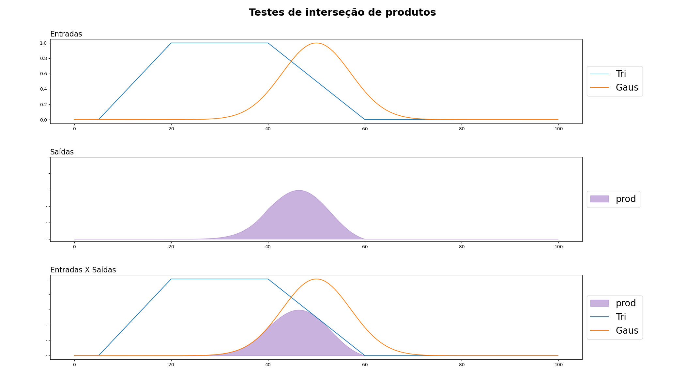
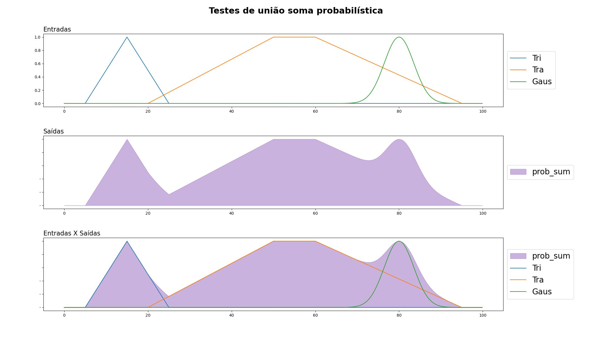
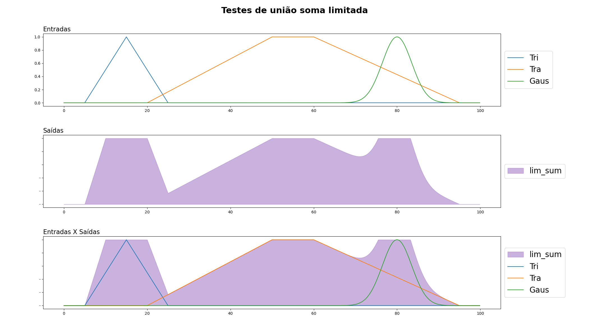

# Fuzzy

Este repositório contém um projeto de implementação de sistemas fuzzy. O trabalho foi realizado utilizando as seguintes ferramentas:

- Python: como linguagem de programação.
- Numpy: Biblioteca de Python para processamento de grandes e multi-dimensionais arranjos arrays, juntamente com uma coleção de funções matemáticas de alto nível para operar sobre estas matrizes.
- Matplotlib: Biblioteca de software para criação de gráficos e visualizações de dados em geral, feita para e da linguagem de programação Python e sua extensão de matemática NumPy.
- Skfuzzy: Biblioteca utilizada para realizar funções de deffuzificação.

> Para mais informações a respeito das bibliotecas e versões utilizadas acesse o arquivo [requirements.txt](/requirements.txt)

### Estrutura do Repositório

O repositório está organizado em várias pastas:

- `fuzzy`: Contém os operadores fuzzy.
- `images`: Contém imagens utilizadas no projeto.
- `instructions`: Contém instruções adicionais para o projeto.
- `utils`: Contém utilitários e funções auxiliares para o projeto.

### Uso

Para usar este repositório, você pode cloná-lo para o seu ambiente local. Em seguida, você pode executar os scripts Python contidos no diretório `fuzzy` para ver os sistemas fuzzy em ação. As funções de pertinência estão definidas na classe `Membership_Function` e os operadores fuzzy estão definidos nas classes `Complement`, `Intercession` e `Union`.

### Definição das funções de pertinência 
As funções de pertinência são um componente fundamental da lógica fuzzy. Elas são usadas para quantificar o grau de verdade de uma afirmação em um sistema fuzzy. Em outras palavras, elas definem o quanto um elemento pertence a um conjunto fuzzy.

Em um sistema clássico de lógica binária, um elemento ou pertence a um conjunto (pertinência = 1) ou não pertence (pertinência = 0). No entanto, na lógica fuzzy, a pertinência de um elemento a um conjunto pode variar entre 0 e 1, permitindo uma gama de valores de verdade.

Existem várias formas de funções de pertinência, cada uma adequada para diferentes tipos de problemas e conjuntos fuzzy. As mais comuns incluem:

* **Funções de pertinência triangular**: Essas funções têm a forma de um triângulo, com o pico representando o ponto de maior pertinência.

* **Funções de pertinência trapezoidal**: Essas funções têm a forma de um trapézio. Elas são úteis quando a pertinência máxima se estende por um intervalo de valores, em vez de um único ponto.

* **Funções de pertinência gaussiana**: Essas funções têm a forma de uma curva gaussiana (ou curva de sino). Elas são úteis quando a pertinência diminui gradualmente à medida que nos afastamos do ponto de maior pertinência.

As funções de pertinência são usadas para mapear a entrada de um sistema fuzzy (como a temperatura em um sistema de controle de temperatura) para um valor de pertinência que pode ser usado para tomar uma decisão ou controle de saída.
#### Função triangular
A função triangular foi dividida em 4 partes:

1. $\ 0,\  se \ x < a $
2. $(x-a)/(m-a), se \ a \leq x \leq m $
3. $(b-x)/(b-m), se \ m \leq x \leq b $
4. $\ 0, \ se \ x > b $

 

    

 

#### Função trapezoidal
A função trapezoidal foi dividida em 5 partes:

1. $\ 0,\  se \ x < a $
2. $(x-a)/(m-a), se \ a \leq x \leq m $
3. $\ 1,\ se\   m \leq x \leq n $
3. $(b-x)/(b-n), se \ n \leq x \leq b $
4. $\ 0, \ se \ x > b $

 

    

#### Função Gaussiana
Para a função gaussiana o retorno utilizado foi a função:
    $$k = k/2$$
    $$e^{-\dfrac{(x-m)^2} {k^2}}$$

 

    

 

    

 

### Operadores

Os operadores fuzzy são usados para combinar ou modificar os valores de pertinência em um sistema fuzzy. Eles são equivalentes aos operadores lógicos na lógica booleana, mas operam em valores de verdade que podem variar entre 0 e 1, em vez de apenas 0 e 1. Os três operadores fuzzy mais comuns são:

* **Complemento (NOT)**: Este operador é usado para inverter um valor de pertinência. Se a pertinência de um elemento a um conjunto fuzzy é p, então o complemento de p é 1-p. Por exemplo, se um elemento tem uma pertinência de 0.7 a um conjunto, seu complemento teria uma pertinência de 0.3.

* **União (OR)**: Este operador é usado para combinar os valores de pertinência de dois elementos. A união de dois conjuntos fuzzy é o conjunto fuzzy que contém todos os elementos que pertencem a pelo menos um dos conjuntos originais. O valor de pertinência de um elemento na união é o máximo dos seus valores de pertinência nos conjuntos originais.

* **Interseção (AND)**: Este operador é usado para encontrar os elementos comuns a dois conjuntos fuzzy. A interseção de dois conjuntos fuzzy é o conjunto fuzzy que contém todos os elementos que pertencem a ambos os conjuntos originais. O valor de pertinência de um elemento na interseção é o mínimo dos seus valores de pertinência nos conjuntos originais.

Esses operadores são fundamentais para a construção de sistemas fuzzy, pois permitem a combinação de diferentes conjuntos fuzzy e a manipulação dos valores de pertinência dentro desses conjuntos.

#### Complemento
Os operadores de complemento são usados na lógica fuzzy para representar a operação NOT. Eles são usados para inverter um valor de pertinência. Existem várias formas de operadores de complemento, cada uma com suas próprias características. Aqui estão as definições dos operadores de complemento de Zadeh, Sugeno e Yager:

1. **Complemento de Zadeh**: Este é o operador de complemento mais simples e mais comum na lógica fuzzy. Se a pertinência de um elemento a um conjunto fuzzy é p, então o complemento de Zadeh de p é 1-p. Por exemplo, se um elemento tem uma pertinência de 0.7 a um conjunto, seu complemento de Zadeh teria uma pertinência de 0.3.

2. **Complemento de Sugeno**: O operador de complemento de Sugeno é definido por uma constante λ, que pode variar de -∞ a ∞. Se a pertinência de um elemento a um conjunto fuzzy é p, então o complemento de Sugeno de p é (1-p)/(1+λp). Quando λ=1, o complemento de Sugeno se torna o complemento de Zadeh.

3. **Complemento de Yager**: O operador de complemento de Yager é definido por uma constante p, que pode variar de 0 a ∞. Se a pertinência de um elemento a um conjunto fuzzy é p, então o complemento de Yager de p é (1-p^q)^(1/q), onde q é um parâmetro que pode ser ajustado. Quando q=1, o complemento de Yager se torna o complemento de Zadeh.

Cada um desses operadores de complemento tem suas próprias características e pode ser mais adequado para certos tipos de problemas ou conjuntos fuzzy. A escolha do operador de complemento apropriado depende das características específicas do problema em questão.

    

    

    

#### União
Os operadores de união são usados na lógica fuzzy para representar a operação OR. Eles são usados para combinar os valores de pertinência de dois elementos. Existem várias formas de operadores de união, cada uma com suas próprias características. Aqui estão as definições dos operadores de união máximo, soma probabilística, soma limitada e soma drástica:

1. **Máximo (Max)**: Este é o operador de união mais comum na lógica fuzzy. Se as pertinências de dois elementos a um conjunto fuzzy são p e q, então a união máxima de p e q é o máximo de p e q. Por exemplo, se um elemento tem uma pertinência de 0.7 e outro tem uma pertinência de 0.5, a união máxima seria 0.7.

2. **Soma Probabilística**: Este operador de união é baseado na teoria da probabilidade. Se as pertinências de dois elementos a um conjunto fuzzy são p e q, então a soma probabilística de p e q é p + q - pq. Este operador é útil quando os eventos são independentes e queremos encontrar a probabilidade de pelo menos um deles ocorrer.

3. **Soma Limitada**: Este operador de união é uma variação do operador de soma probabilística. Se as pertinências de dois elementos a um conjunto fuzzy são p e q, então a soma limitada de p e q é min(1, p + q). Este operador é útil quando queremos evitar que a pertinência ultrapasse 1.

4. **Soma Drástica**: Este operador de união é usado quando queremos expressar uma lógica de "tudo ou nada". Se as pertinências de dois elementos a um conjunto fuzzy são p e q, então a soma drástica de p e q é min(p, q) se max(p, q) = 1, e 0 caso contrário.

    

    

    

    

#### Interseção
Os operadores de interseção são usados na lógica fuzzy para representar a operação AND. Eles são usados para encontrar os elementos comuns a dois conjuntos fuzzy. Existem várias formas de operadores de interseção, cada uma com suas próprias características. Aqui estão as definições dos operadores de interseção mínimo, produto, produto limitado e produto drástico:

1. **Mínimo (Min)**: Este é o operador de interseção mais comum na lógica fuzzy. Se as pertinências de dois elementos a um conjunto fuzzy são p e q, então a interseção mínima de p e q é o mínimo de p e q. Por exemplo, se um elemento tem uma pertinência de 0.7 e outro tem uma pertinência de 0.5, a interseção mínima seria 0.5.

2. **Produto**: Este operador de interseção é baseado na multiplicação dos valores de pertinência. Se as pertinências de dois elementos a um conjunto fuzzy são p e q, então o produto de p e q é p*q. Este operador é útil quando os eventos são independentes e queremos encontrar a probabilidade de ambos ocorrerem.

3. **Produto Limitado**: Este operador de interseção é uma variação do operador de produto. Se as pertinências de dois elementos a um conjunto fuzzy são p e q, então o produto limitado de p e q é max(0, p + q - 1). Este operador é útil quando queremos evitar que a pertinência caia abaixo de 0.

4. **Produto Drástico**: Este operador de interseção é usado quando queremos expressar uma lógica de "tudo ou nada". Se as pertinências de dois elementos a um conjunto fuzzy são p e q, então o produto drástico de p e q é max(p, q) se min(p, q) = 0, e min(p, q) caso contrário.

    

    

    

    

### Contribuição

Contribuições para este repositório são bem-vindas. Se você encontrar um bug ou gostaria de adicionar uma nova funcionalidade, sinta-se à vontade para abrir uma issue ou um pull request.
